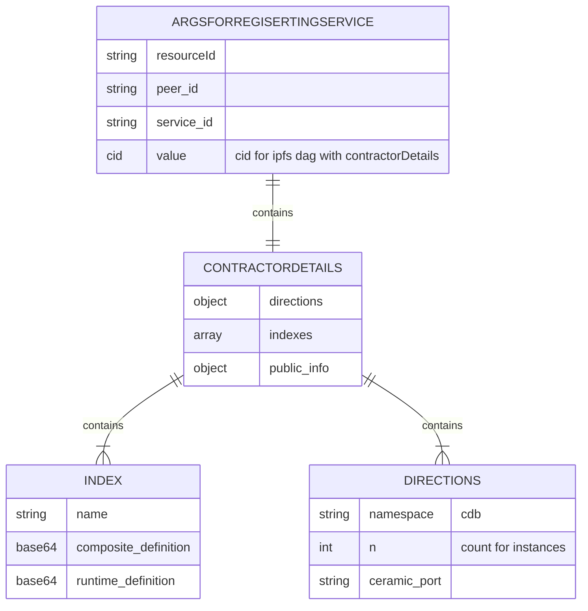

# Fluence+ComposeDB

Transport Union explores distributed backend applications that are governed by collective decision making, seeking innovations by combining functionalities of various decentralized protocols. 

This is a proof of concept demo to show:

1. decentralized access to ComposeDB resource providers,
2. authentication with DID-session


## Fluence

[Fluence](https://fluence.dev/docs/learn/overview) is an open, permisisonless peer-to-peer compute protocol facilitating decentralized serverless compute such as FaaS. Fluence provides [Aqua](https://fluence.dev/docs/aqua-book/introduction), an open-source, peer-to-peer Web3-native choreography and composition language to create distributed workflows, similar to [AWS Stepfunctions](https://aws.amazon.com/step-functions/). Moreover, Aqua can be used to program the network and easily integrate with peers' [sidecars](https://learn.microsoft.com/en-us/azure/architecture/patterns/sidecar). That is, Fluence peers can operate or pair with nodes from other protocols, such as IPFS, Ethereum or Ceramic, and developers can than use Aqua, in conjunction with distributed, FaaS connectors, to create seamless, Web3-native integration across protocols and networks. Hence, the Fluence protocol allows developers to deploy dApps to *decentralized serverless* as opposed to, say, the browser.

## ComposeDB

[ComposeDB](https://composedb.js.org/) is a decentralised database build on top of Ceramic/IPFS with a graphql interface. Normally, dApps have their own ComposeDB instance running on a server with a single endpoint. 

## Approach

Fluence network provides two main functionalities, namely 1/ a decentralised marketplace for peers offering services, and  2/ microservices exposing a command line interface for a node of a different protocol. Combining the two we can create a marketplace for access to various protocols and their functionalities. 

This branch contains an alternative command line interface for ComposeDB tailored to work with Fluence services. I have used the default frontend libraries made by the Composedb team. 

## Documentation in Progress

ComposeDB terminology: A data structure is represented as a composite which is made up from (re-usable) models. This composite has 1/a composite-definition used to create necessary elements on the ceramic network, and 2/ a runtime definition used to index the data for the composite. Indexing the data means that the ComposeDB instance will store data related to the composite in a local sql database that can be queried with graphQL.


The initialization of the marine service involves 1/ command to the custom ComposeDB cli to start indexing the data for data 2/ the creation of an object with contractorDetails 3/ storing that object on the Fluence peer's local IPFS node, 4/ returining the cid, and then registering the service on the network with the cid included in the value property 

&nbsp;

&nbsp;


```mermaid 
sequenceDiagram;

    participant Aqua
    participant Marine
    participant IPFS 
    participant /usr/bin/tu-cdb

    Aqua->>Marine: Init(namespace,n,_indexes,pk)
    Marine->>/usr/bin/tu-cdb: index(_index,pk)
    Marine->>Marine: creates contractorDetails 
    Marine->>IPFS: Store contractorDetails
    IPFS->>Aqua: cid
    Aqua->>Aqua: register_resource(peerId,serviceId,cid)
```


Diagram below 

&nbsp;

&nbsp;



&nbsp;

&nbsp;


```mermaid 
sequenceDiagram;

    participant Metamask
    participant Frontend
    participant Aqua
    participant Marine
    participant IPFS 
    participant /usr/bin/tu-cdb

    Frontend ->> Aqua: findContractors()
    Aqua ->> Aqua: getRecords()
    Aqua ->> Frontend: []contractors
    Frontend ->> Marine: forEach: getContractorDetails(cid)
    Marine ->> IPFS: dag get cid
    IPFS ->> Marine: contractorDetails
    Marine ->> Frontend: contractorDetails
    Frontend ->> Frontend: selectContractor()
    Frontend ->> Aqua: renewProfileList() 
    Aqua ->> Marine: cdbQuery(cid, runtime_def,query)
    Marine ->> /usr/bin/tu-cdb: query(runtime_def,query)
    /usr/bin/tu-cdb ->> Frontend: content 
    Frontend ->> Frontend: hasValidSession()
    Frontend ->> Metamask: if session is unsigned
    Metamask ->> Frontend: signature
    Frontend ->> Aqua: update()
    Aqua ->> Marine: cdbMutate(cid, runtime_def,query,session)
    Marine ->> /usr/bin/tu-cdb: mutate(runtime_def,query,session)
    /usr/bin/tu-cdb ->> Frontend: result 
    Frontend ->> Aqua: renewProfileList() 
    Aqua ->> Marine: cdbQuery(cid, runtime_def,query)
    Marine ->> /usr/bin/tu-cdb: query(runtime_def,query)
    /usr/bin/tu-cdb ->> Frontend: content 


```
&nbsp;

&nbsp;


[DEMO HERE!](https://fluence-composedb.transport-union.dev/)

&nbsp;

&nbsp;


## globals

    nvm use 16
    npm -g i @fluencelabs/aqua@0.7.7-363 @fluencelabs/registry@0.7.0 @fluencelabs/trust-graph@3.0.4 
    npm -g i typescript@4.9.3

## install 

    docker-compose -f docker/docker-compose.yaml up -d 


## deploy the marine service 

    1/ sh scripts/dev/build.sh
    2/ sh scripts/dev/deploy.sh
    3/ copy returned service_id into scripts/.env file
    4/ sh scripts/dev/init.sh


## serve frontend on localhost:3000

    cd frontend/ 
    npm i
    npm run serve

## changes to aqua 

    cd frontend
    npm run compile-aqua
    
    
