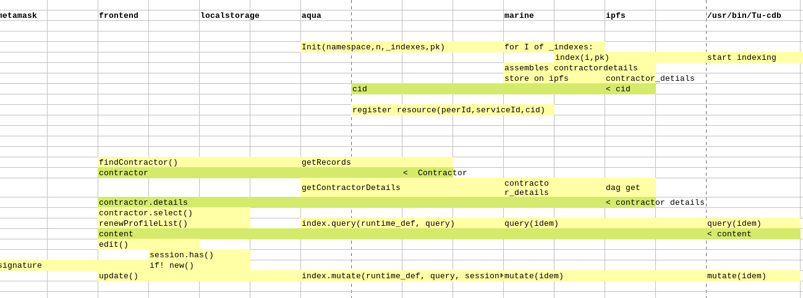

# Fluence+ComposeDB

[Fluence](https://fluence.dev/docs/learn/overview) and its aqua language provide a logistics functionality to web3. Fluence nodes can pair with nodes of other protocols within a closed docker network, so that we can program actions across the Fluence network piecing together functionality from other protocols into dapps that run in a network (rather than in your browser or on a single server).

Say you would want to store blockchain data in a decentralised database. How would you program the scraper, the cleaning and formatting of the data without becoming depended on a single server and using fixed endpoints? 

[ComposeDB](https://composedb.js.org/) is a decentralised database build on top of Ceramic/IPFS with a graphql interface. Normally, dapps have their own composeDB instance running on a server with a single endpoint. 

### Protocol pairs
This demo explores the pairing of fluence nodes with a ComposeDB/Ceramic nodes. Have a look at the [docker-compose file](./docker/docker-compose.yaml). 

Such a pairing then registers itself on a distributed hashtable on the fluence network, signaling it wishes to facilitate access to a ComposeDB index. These are then called resource providers. 

On the frontend you can select one of the available resource providers to make a read only connection. 

### Identity ... 
To write to ComposeDB we need to set up an authenticated connection, using the secret of a DID. 

This secret is generated by the frontend en then encrypted with public encryption keys of the ethereum address of the user and the resource provider, so it can pe stored and passed around securely. The DID is called an intermediary. 

To set up the authenticated connection we also have to create a capability object signed with the ethereum address of the user. The resource provider validates that signature to make sure the updates are being requested by the correct user. 

[DEMO HERE!](https://fluence-composedb.transport-union.dev/)

## globals

    nvm use 16
    npm -g i @fluencelabs/aqua@0.7.7-363 @fluencelabs/registry@0.7.0 @fluencelabs/trust-graph@3.0.4 
    npm -g i typescript@4.9.3

## install 

    docker-compose -f docker/docker-compose.yaml up -d 

## deploy the marine service 

    1/ sh scripts/dev/build.sh
    2/ sh scripts/dev/deploy.sh
    3/ copy returned service_id into scripts/.env file
    4/ sh scripts/dev/init.sh

## serve frontend on localhost:3000

    cd frontend/ 
    npm i
    npm run serve

## changes to aqua 

    cd frontend
    npm run compile-aqua 

## changes to node-server 

    cd node_server 
    sh build.sh
    .. deploy ... 
    # on server ... 
    docker-compose up -d --build composedb-server
    
    